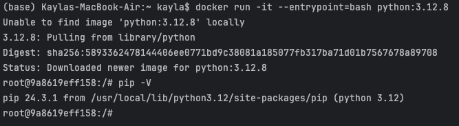

# Kayla Tinker HW #1 Answers

## Question 1. Understanding docker first run 

Run docker with the `python:3.12.8` image in an interactive mode, use the entrypoint `bash`.

:question: What's the version of `pip` in the image?

- 24.3.1
- 24.2.1
- 23.3.1
- 23.2.1

:white_check_mark: ANSWER **24.3.1**

:bulb: Video help [1.2.1 14:40](https://youtu.be/EYNwNlOrpr0?si=UkiMb8rD7GoCE1H2&t=880)

:pencil: Work for solution

`docker run -it --entrypoint=bash python:3.12.8`

`pip -V`

output: pip 24.3.1

:black_square: Full terminal image of work



***

## Question 2. Understanding Docker networking and docker-compose

:question: Given the following `docker-compose.yaml`, what is the `hostname` and `port` that **pgadmin** should use to connect to the postgres database?

```yaml
services:
  db:
    container_name: postgres
    image: postgres:17-alpine
    environment:
      POSTGRES_USER: 'postgres'
      POSTGRES_PASSWORD: 'postgres'
      POSTGRES_DB: 'ny_taxi'
    ports:
      - '5433:5432'
    volumes:
      - vol-pgdata:/var/lib/postgresql/data

  pgadmin:
    container_name: pgadmin
    image: dpage/pgadmin4:latest
    environment:
      PGADMIN_DEFAULT_EMAIL: "pgadmin@pgadmin.com"
      PGADMIN_DEFAULT_PASSWORD: "pgadmin"
    ports:
      - "8080:80"
    volumes:
      - vol-pgadmin_data:/var/lib/pgadmin  

volumes:
  vol-pgdata:
    name: vol-pgdata
  vol-pgadmin_data:
    name: vol-pgadmin_data
```

- postgres:5433
- localhost:5432
- db:5433
- postgres:5432
- db:5432

If there are more than one answers, select only one of them

:white_check_mark: ANSWER **db:5432**

:bulb: container_name vs. pgAdmin hostname and 5433 vs 5432

:question: I see that either container_name or server_name work as the host here. From what I've
read, the mapped port for postgres could be 5433 as well...so I will need to
read up more about that.

***

## Question 3. Trip Segmentation Count

During the period of October 1st 2019 (inclusive) and November 1st 2019 (exclusive), how many trips, **respectively**, happened:
1. Up to 1 mile
2. In between 1 (exclusive) and 3 miles (inclusive),
3. In between 3 (exclusive) and 7 miles (inclusive),
4. In between 7 (exclusive) and 10 miles (inclusive),
5. Over 10 miles 

Answers:

- 104,802;  197,670;  110,612;  27,831;  35,281
- 104,802;  198,924;  109,603;  27,678;  35,189
- 104,793;  201,407;  110,612;  27,831;  35,281
- 104,793;  202,661;  109,603;  27,678;  35,189
- 104,838;  199,013;  109,645;  27,688;  35,202

:question: does 'up to' 1 mile include mile 1? I am assuming it does.

:white_check_mark: ANSWER **104,802;198,924;109,603;27,678;35,189**

:pencil: notes [oct1,nov1) how many trips for different distances?
[0,1] or (1,3] or (3,7] or (7,10], or (10,infinity]


a. Distance [0,1]
    
Code:

```sql
SELECT COUNT(*)
FROM green_taxi
WHERE (trip_distance <= 1) AND (lpep_dropoff_datetime >= '2019-10-01') AND (lpep_dropoff_datetime < '2019-11-01')
```


Output: **104,802**

b. Distance (1,3] 

Code:

```sql
SELECT COUNT(*)
FROM green_taxi
WHERE (trip_distance > 1) AND (trip_distance <= 3) AND (lpep_dropoff_datetime >= '2019-10-01') AND (lpep_dropoff_datetime < '2019-11-01')
```

Output: **198,924**

c. Distance (3,7]

Code:

```sql
SELECT COUNT(*)
FROM green_taxi
WHERE (trip_distance > 3) AND (trip_distance <= 7) AND (lpep_dropoff_datetime >= '2019-10-01') AND (lpep_dropoff_datetime < '2019-11-01')
```

Output: **109,603**


d. Distance (7,10]

Code:

```sql
SELECT COUNT(*)
FROM green_taxi
WHERE (trip_distance > 7) AND (trip_distance <= 10) AND (lpep_dropoff_datetime >= '2019-10-01') AND (lpep_dropoff_datetime < '2019-11-01')
```

Output: **27,678**


e. Distance (10,infinity]

Code:

```sql
SELECT COUNT(*)
FROM green_taxi
WHERE (trip_distance > 10) AND (lpep_dropoff_datetime >= '2019-10-01') AND (lpep_dropoff_datetime < '2019-11-01')
```

Output: **35,189**

***

## Question 4. Longest trip for each day

Which was the pick up day with the longest trip distance?
Use the pick up time for your calculations.

Tip: For every day, we only care about one single trip with the longest distance. 

- 2019-10-11
- 2019-10-24
- 2019-10-26
- 2019-10-31

:white_check_mark: ANSWER **2019-10-31**

:pencil: notes - we only need lpep_pickup_datetime and trip_distance columns.

:question: The way I am reading it, we just need ONE single trip distance...

```sql
SELECT lpep_pickup_datetime, trip_distance 
FROM public.green_taxi
ORDER BY trip_distance DESC
LIMIT 1
```

***

## Question 5. Three biggest pickup zones

Which were the top pickup locations with over 13,000 in
`total_amount` (across all trips) for 2019-10-18?

Consider only `lpep_pickup_datetime` when filtering by date.
 
- East Harlem North, East Harlem South, Morningside Heights
- East Harlem North, Morningside Heights
- Morningside Heights, Astoria Park, East Harlem South
- Bedford, East Harlem North, Astoria Park

:white_check_mark: ANSWER **East Harlem North, East Harlem South, Morningside Heights**

:pencil: notes - we need to join in zones. We need lpep_pickup_datetime=2019-10-18, total_amount > 13,000 
Then join by Location ID

:question: The way I am reading it, we need to sum...across all trips? ok, so
maybe I need to sort by location and sum up per location on that day?

```sql
SELECT z."Zone", SUM(t."total_amount") as amt_sum
FROM green_taxi t JOIN zones z ON z."LocationID" = t."PULocationID"
WHERE (t."lpep_pickup_datetime" > '2019-10-18') AND (t."lpep_pickup_datetime" < '2019-10-19')
GROUP BY z."Zone"
HAVING SUM(t."total_amount") > 13000
ORDER BY amt_sum DESC
```


***

## Question 6. Largest tip

For the passengers picked up in October 2019 in the zone
name "East Harlem North" which was the drop off zone that had
the largest tip?

Note: it's `tip` , not `trip`

We need the name of the zone, not the ID.

- Yorkville West
- JFK Airport
- East Harlem North
- East Harlem South

:white_check_mark: ANSWER **JFK Airport**

:pencil: lpep_pickup_datetime only in october, zone name = "East Harlem North",
need to now join DropOff ID to get drop off zone, and tip_amount

:question: I am assuming largest tip for ONE trip?

```sql
SELECT zpu."Zone" as zone_up, t."tip_amount", zdo."Zone" as zone_off
FROM green_taxi t JOIN zones zdo ON zdo."LocationID" = t."DOLocationID" JOIN zones zpu ON zpu."LocationID" = t."PULocationID"
WHERE (t."lpep_pickup_datetime" >= '2019-10-01') AND (t."lpep_pickup_datetime" < '2019-11-01') AND zpu."Zone" = 'East Harlem North'
ORDER BY t."tip_amount" DESC
Limit 1
```

***

## Question 7. Terraform Workflow

Which of the following sequences, **respectively**, describes the workflow for: 
1. Downloading the provider plugins and setting up backend,
2. Generating proposed changes and auto-executing the plan
3. Remove all resources managed by terraform`

Answers:
- terraform import, terraform apply -y, terraform destroy
- teraform init, terraform plan -auto-apply, terraform rm
- terraform init, terraform run -auto-approve, terraform destroy
- terraform init, terraform apply -auto-approve, terraform destroy
- terraform import, terraform apply -y, terraform rm

:white_check_mark: ANSWER **terraform init, terraform apply -auto-approve, terraform destroy**

