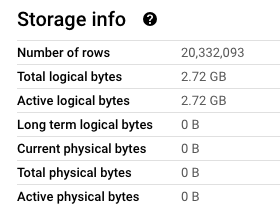
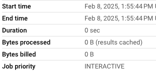
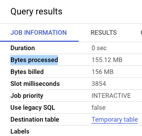
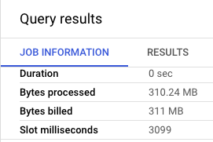
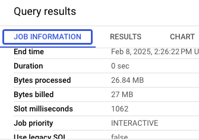

# Kayla Tinker HW #3 Answers

## Question 1:
What is count of records for the 2024 Yellow Taxi Data?
- 65,623
- 840,402
- 20,332,093
- 85,431,289

:white_check_mark: ANSWER **20,332,093**

```sql
-- Creating external table referring to gcs path
CREATE OR REPLACE EXTERNAL TABLE `taxi-rides-ny-448101.de_zoomcamp.external_yellow_tripdata`
OPTIONS (
  format = 'PARQUET',
  uris = ['gs://taxi-rides-ny-448101-module-3/yellow_tripdata_2024-*.parquet']
);

-- Create a regular
CREATE OR REPLACE TABLE taxi-rides-ny-448101.de_zoomcamp.e_yellow_tripdata_regular AS
SELECT * FROM taxi-rides-ny-448101.de_zoomcamp.external_yellow_tripdata;

-- Grab number of records NOTE that Jan - Jun 2024 only
SELECT COUNT(*)
FROM taxi-rides-ny-448101.de_zoomcamp.external_yellow_tripdata
```
*OR* Can just check regular table for size:



:bulb: From video 3.1.1

## Question 2.
Write a query to count the distinct number of PULocationIDs for the 
entire dataset on both the tables. What is the **estimated amount** of 
data that will be read when this query is executed on the 
External Table and the Table?

- 18.82 MB for the External Table and 47.60 MB for the Materialized Table
- 0 MB for the External Table and 155.12 MB for the Materialized Table
- 2.14 GB for the External Table and 0MB for the Materialized Table
- 0 MB for the External Table and 0MB for the Materialized Table

:white_check_mark: ANSWER **0 MB for the External Table and 155.12 MB for the Materialized Table**

```sql
-- Distinct PULocationIDs External
SELECT COUNT(DISTINCT(PULocationID))
FROM taxi-rides-ny-448101.de_zoomcamp.external_yellow_tripdata;

-- Distinct PULocationIDs Materialized
SELECT COUNT(DISTINCT(PULocationID))
FROM taxi-rides-ny-448101.de_zoomcamp.e_yellow_tripdata_regular
```
:pencil: Then check the 'Job Information' **Bytes processed**

**External**



**Materialized**




## Question 3:
Write a query to retrieve the PULocationID from the table 
(not the external table) in BigQuery. Now write a query to 
retrieve the PULocationID and DOLocationID on the same table. 
**Why are the estimated number of Bytes different?**

- BigQuery is a columnar database, and it only scans the specific 
columns requested in the query. Querying two columns 
(PULocationID, DOLocationID) requires reading more data than 
querying one column (PULocationID), leading to a higher estimated 
number of bytes processed.


- BigQuery duplicates data across multiple storage partitions, 
so selecting two columns instead of one requires scanning the table twice, 
doubling the estimated bytes processed.


- BigQuery automatically caches the first queried column, so adding a 
second column increases processing time but does not affect the estimated
bytes scanned.


- When selecting multiple columns, BigQuery performs an implicit join 
operation between them, increasing the estimated bytes processed


:white_check_mark: ANSWER **BigQuery is a columnar database, and it only scans the specific 
columns requested in the query. Querying two columns 
(PULocationID, DOLocationID) requires reading more data than 
querying one column (PULocationID), leading to a higher estimated 
number of bytes processed.**

```sql
-- PULocationIDs Materialized
SELECT PULocationID
FROM taxi-rides-ny-448101.de_zoomcamp.e_yellow_tripdata_regular;

-- PULocationIDs, DOLocationID Materialized
SELECT PULocationID, DOLocationID
FROM taxi-rides-ny-448101.de_zoomcamp.e_yellow_tripdata_regular;
```


## Question 4.
How many records have a fare_amount of 0?
- 128,210
- 546,578
- 20,188,016
- 8,333

:white_check_mark: ANSWER **8,333**

```sql
-- Count fare_amount = 0
SELECT Count(1)
FROM taxi-rides-ny-448101.de_zoomcamp.e_yellow_tripdata_regular
WHERE fare_amount = 0
```

## Question 5.
What is the best strategy to make an optimized table in Big Query if your 
query will always filter based on tpep_dropoff_datetime and 
order the results by VendorID (Create a new table with this strategy)

- Partition by tpep_dropoff_datetime and Cluster on VendorID
- Cluster on by tpep_dropoff_datetime and Cluster on VendorID
- Cluster on tpep_dropoff_datetime Partition by VendorID
- Partition by tpep_dropoff_datetime and Partition by VendorID

:white_check_mark: ANSWER **Partition by tpep_dropoff_datetime and Cluster on VendorID**

```sql
-- Creating a partition and cluster table
CREATE OR REPLACE TABLE taxi-rides-ny-448101.de_zoomcamp.pc_yellow_tripdata_regular
PARTITION BY DATE(tpep_dropoff_datetime)
CLUSTER BY VendorID AS
SELECT * FROM taxi-rides-ny-448101.de_zoomcamp.e_yellow_tripdata_regular;
```

## Question 6.
Write a query to retrieve the distinct VendorIDs between tpep_dropoff_datetime
2024-03-01 and 2024-03-15 (inclusive)

Use the materialized table you created earlier in your from clause 
and note the estimated bytes. Now change the table in the from clause to the 
partitioned table you created for question 5 and note the 
estimated bytes processed. **What are these values?**

_Choose the answer which most closely matches._

- 12.47 MB for non-partitioned table and 326.42 MB for the partitioned table
- 310.24 MB for non-partitioned table and 26.84 MB for the partitioned table
- 5.87 MB for non-partitioned table and 0 MB for the partitioned table
- 310.31 MB for non-partitioned table and 285.64 MB for the partitioned table


:white_check_mark: ANSWER **310.24 MB for non-partitioned table and 26.84 MB for the partitioned table**

:pencil: It will be higher for non-partitioned

```sql
-- Distinct VendorIDs Materialized
SELECT DISTINCT(VendorID)
FROM taxi-rides-ny-448101.de_zoomcamp.e_yellow_tripdata_regular
WHERE tpep_dropoff_datetime >= '2024-03-01' and tpep_dropoff_datetime <= '2024-03-15'
```



```sql
-- Distinct VendorIDs Materialized Partitioned and clustered
SELECT DISTINCT(VendorID)
FROM taxi-rides-ny-448101.de_zoomcamp.pc_yellow_tripdata_regular
WHERE tpep_dropoff_datetime >= '2024-03-01' and tpep_dropoff_datetime <= '2024-03-15'
```




## Question 7: 
Where is the data stored in the External Table you created?

- Big Query
- Container Registry
- GCP Bucket
- Big Table

:white_check_mark: ANSWER **GCP Bucket**

## Question 8:
It is best practice in Big Query to always cluster your data:
- True
- False

:white_check_mark: ANSWER **False**


## Bonus
No Points: Write a `SELECT count(*)` query FROM the materialized table you 
created. How many bytes does it estimate will be read? Why?


--

:white_check_mark: ANSWER **...**
:exclamation:
:pencil:
:bulb: 
:question: