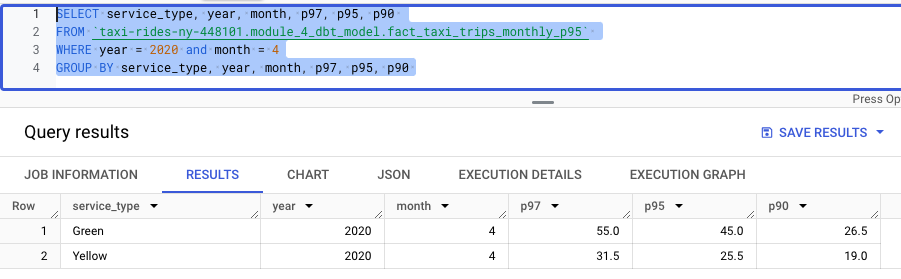

# Kayla Tinker HW #4 Answers

For this homework, you will need the following datasets:
* [Green Taxi dataset (2019 and 2020)](https://github.com/DataTalksClub/nyc-tlc-data/releases/tag/green)
* [Yellow Taxi dataset (2019 and 2020)](https://github.com/DataTalksClub/nyc-tlc-data/releases/tag/yellow)
* [For Hire Vehicle dataset (2019)](https://github.com/DataTalksClub/nyc-tlc-data/releases/tag/fhv)

:bulb: I used url2bucket.py to grab data and placed into GCP buckets. Then used sql from module 3 video 1 to add external
tables into BigQuery and recopied those over.

### Question 1: Understanding dbt model resolution

Provided you've got the following sources.yaml
```yaml
version: 2

sources:
  - name: raw_nyc_tripdata
    database: "{{ env_var('DBT_BIGQUERY_PROJECT', 'dtc_zoomcamp_2025') }}"
    schema:   "{{ env_var('DBT_BIGQUERY_SOURCE_DATASET', 'raw_nyc_tripdata') }}"
    tables:
      - name: ext_green_taxi
      - name: ext_yellow_taxi
```

with the following env variables setup where `dbt` runs:
```shell
export DBT_BIGQUERY_PROJECT=myproject
export DBT_BIGQUERY_DATASET=my_nyc_tripdata
```

What does this .sql model compile to?
```sql
select * 
from {{ source('raw_nyc_tripdata', 'ext_green_taxi' ) }}
```

- `select * from dtc_zoomcamp_2025.raw_nyc_tripdata.ext_green_taxi`
- `select * from dtc_zoomcamp_2025.my_nyc_tripdata.ext_green_taxi`
- `select * from myproject.raw_nyc_tripdata.ext_green_taxi`
- `select * from myproject.my_nyc_tripdata.ext_green_taxi`
- `select * from dtc_zoomcamp_2025.raw_nyc_tripdata.green_taxi`

:pencil: In BigQuery, the terms project and database are interchangeable. So
your database name would be `dtc_zoomcamp_2025`, but the export takes priority, thus it
will be `myproject`. Which in our examples we work under the same project, so I am unsure why
we would want to change it, but according to the links below that is what export does. Then the model output, wouldn't
live where your raw data does, so that would be what you call `my_nyc_tripdata`.
And with the information given, the only table name is `ext_green_taxi`.
Ok, so we are setting our env_var using `export` here according to
https://stackoverflow.com/questions/72956095/dbt-environment-variables-and-running-dbt
https://docs.getdbt.com/docs/build/environment-variables

:white_check_mark: ANSWER **`select * from myproject.my_nyc_tripdata.ext_green_taxi`**


### Question 2: dbt Variables & Dynamic Models

Say you have to modify the following dbt_model (`fct_recent_taxi_trips.sql`) to enable Analytics Engineers to dynamically control the date range. 

- In development, you want to process only **the last 7 days of trips**
- In production, you need to process **the last 30 days** for analytics

```sql
select *
from {{ ref('fact_taxi_trips') }}
where pickup_datetime >= CURRENT_DATE - INTERVAL '30' DAY
```

What would you change to accomplish that in a such way that command line arguments takes precedence over ENV_VARs, which takes precedence over DEFAULT value?

- Add `ORDER BY pickup_datetime DESC` and `LIMIT {{ var("days_back", 30) }}`
- Update the WHERE clause to `pickup_datetime >= CURRENT_DATE - INTERVAL '{{ var("days_back", 30) }}' DAY`
- Update the WHERE clause to `pickup_datetime >= CURRENT_DATE - INTERVAL '{{ env_var("DAYS_BACK", "30") }}' DAY`
- Update the WHERE clause to `pickup_datetime >= CURRENT_DATE - INTERVAL '{{ var("days_back", env_var("DAYS_BACK", "30")) }}' DAY`
- Update the WHERE clause to `pickup_datetime >= CURRENT_DATE - INTERVAL '{{ env_var("DAYS_BACK", var("days_back", "30")) }}' DAY`

:pencil: To set variables we use `var`, and we can set a default if the variable isn't
provided, so that default here could be `30`. BUT we want the env_var
to take precedence over the Default value, thus we use env_var for it. 
From CLI, we need --var, thus we need to use var to 'override' the above options. This is 
somewhat shown in video 4.3.1 min 38, but env_var is not discussed and needs to be found in dtb
documentation - https://docs.getdbt.com/reference/dbt-jinja-functions/env_var
and https://docs.getdbt.com/docs/build/environment-variables

:white_check_mark: ANSWER **Update the WHERE clause to `pickup_datetime >= CURRENT_DATE - INTERVAL '{{ var("days_back", env_var("DAYS_BACK", "30")) }}' DAY**

:question: I feel like it could be any of these...


### Question 3: dbt Data Lineage and Execution

Considering the data lineage below **and** that 
taxi_zone_lookup is the **only** materialization build (from a .csv seed file):


Select the option that does **NOT** apply for 
materializing `fct_taxi_monthly_zone_revenue`:

- `dbt run`
- `dbt run --select +models/core/dim_taxi_trips.sql+ --target prod`
- `dbt run --select +models/core/fct_taxi_monthly_zone_revenue.sql`
- `dbt run --select +models/core/`
- `dbt run --select models/staging/+`

:pencil: key work 'materialized'. So I am thinking it would be the /staging/+

:white_check_mark: ANSWER **`dbt run --select models/staging/+`*


### Question 4: dbt Macros and Jinja

Consider you're dealing with sensitive data (e.g.: [PII](https://en.wikipedia.org/wiki/Personal_data)), 
that is **only available to your team and very selected few individuals**, 
in the `raw layer` of your DWH (e.g: a specific BigQuery dataset or PostgreSQL schema), 

 - Among other things, you decide to obfuscate/masquerade that data through your staging models, 
and make it available in a different schema (a `staging layer`) for other Data/Analytics Engineers to explore

- And **optionally**, yet  another layer (`service layer`), where you'll build your 
dimension (`dim_`) and fact (`fct_`) tables (assuming the [Star Schema dimensional modeling](https://www.databricks.com/glossary/star-schema)) for Dashboarding and for Tech Product Owners/Managers

You decide to make a macro to wrap a logic around it:

```sql


    
    

     {{- env_var(target_env_var) -}}
                        {{- env_var(stging_env_var, env_var(target_env_var)) -}}
    


```

And use on your staging, dim_ and fact_ models as:
```sql
{{ config(
    schema=resolve_schema_for('core'), 
) }}
```

That all being said, regarding macro above, 
**select all statements that are true to the models using it**:

- Setting a value for  `DBT_BIGQUERY_TARGET_DATASET` env var is mandatory, or it'll fail to compile
- Setting a value for `DBT_BIGQUERY_STAGING_DATASET` env var is mandatory, or it'll fail to compile
- When using `core`, it materializes in the dataset defined in `DBT_BIGQUERY_TARGET_DATASET`
- When using `stg`, it materializes in the dataset defined in `DBT_BIGQUERY_STAGING_DATASET`, or defaults to `DBT_BIGQUERY_TARGET_DATASET`
- When using `staging`, it materializes in the dataset defined in `DBT_BIGQUERY_STAGING_DATASET`, or defaults to `DBT_BIGQUERY_TARGET_DATASET`

:white_check_mark: ANSWER **ALL except Setting a value for `DBT_BIGQUERY_STAGING_DATASET**


### Question 5: Taxi Quarterly Revenue Growth

1. Create a new model `fct_taxi_trips_quarterly_revenue.sql`
2. Compute the Quarterly Revenues for each year for based on `total_amount`
3. Compute the Quarterly YoY (Year-over-Year) revenue growth 
  * e.g.: In 2020/Q1, Green Taxi had -12.34% revenue growth compared to 2019/Q1
  * e.g.: In 2020/Q4, Yellow Taxi had +34.56% revenue growth compared to 2019/Q4

Considering the YoY Growth in 2020, which were the yearly quarters with the best (or less worse) 
and worst results for green, and yellow

- green: {best: 2020/Q2, worst: 2020/Q1}, yellow: {best: 2020/Q2, worst: 2020/Q1}
- green: {best: 2020/Q2, worst: 2020/Q1}, yellow: {best: 2020/Q3, worst: 2020/Q4}
- green: {best: 2020/Q1, worst: 2020/Q2}, yellow: {best: 2020/Q2, worst: 2020/Q1}
- green: {best: 2020/Q1, worst: 2020/Q2}, yellow: {best: 2020/Q1, worst: 2020/Q2}
- green: {best: 2020/Q1, worst: 2020/Q2}, yellow: {best: 2020/Q3, worst: 2020/Q4}

:white_check_mark: ANSWER **green: {best: 2020/Q1, worst: 2020/Q2}, yellow: {best: 2020/Q1, worst: 2020/Q2}**

:pencil: See question5.sql for details

:question: but my data does not match the e.g. examples...which apparently is ok. 


### Question 6: P97/P95/P90 Taxi Monthly Fare

1. Create a new model `fct_taxi_trips_monthly_fare_p95.sql`
2. Filter out invalid entries (`fare_amount > 0`, `trip_distance > 0`, and `payment_type_description in ('Cash', 'Credit Card')`)
3. Compute the **continuous percentile** of `fare_amount` partitioning 
by service_type, year and month

Now, what are the values of `p97`, `p95`, `p90` for Green Taxi and Yellow Taxi, in April 2020?

- green: {p97: 55.0, p95: 45.0, p90: 26.5}, yellow: {p97: 52.0, p95: 37.0, p90: 25.5}
- green: {p97: 55.0, p95: 45.0, p90: 26.5}, yellow: {p97: 31.5, p95: 25.5, p90: 19.0}
- green: {p97: 40.0, p95: 33.0, p90: 24.5}, yellow: {p97: 52.0, p95: 37.0, p90: 25.5}
- green: {p97: 40.0, p95: 33.0, p90: 24.5}, yellow: {p97: 31.5, p95: 25.5, p90: 19.0}
- green: {p97: 55.0, p95: 45.0, p90: 26.5}, yellow: {p97: 52.0, p95: 25.5, p90: 19.0}


:pencil: continuous percentile or p97, p95, and p90. Need to use percentile_cont from
https://stackoverflow.com/questions/45579692/percentile-functions-with-groupby-in-bigquery/45579962#45579962
https://cloud.google.com/bigquery/docs/reference/standard-sql/navigation_functions#percentile_cont
And what a pain, I needed to use lowercase for my payment_type_description. 

:pencil: See question6.sql for details

:white_check_mark: ANSWER **green: {p97: 55.0, p95: 45.0, p90: 26.5}, yellow: {p97: 31.5, p95: 25.5, p90: 19.0}**




### Question 7: Top #Nth longest P90 travel time Location for FHV

Prerequisites:
* Create a staging model for FHV Data (2019), and **DO NOT** add a deduplication step, 
just filter out the entries where `where dispatching_base_num is not null`
* Create a core model for FHV Data (`dim_fhv_trips.sql`) joining with `dim_zones`. 
Similar to what has been done [here](../../../04-analytics-engineering/taxi_rides_ny/models/core/fact_trips.sql)
* Add some new dimensions `year` (e.g.: 2019) and `month` (e.g.: 1, 2, ..., 12), 
based on `pickup_datetime`, to the core model to facilitate filtering for your queries

Now...
1. Create a new model `fct_fhv_monthly_zone_traveltime_p90.sql`
2. For each record in `dim_fhv_trips.sql`, compute 
the [timestamp_diff](https://cloud.google.com/bigquery/docs/reference/standard-sql/timestamp_functions#timestamp_diff) in seconds between dropoff_datetime and pickup_datetime - we'll call it `trip_duration` for this exercise
3. Compute the **continous** `p90` of `trip_duration` partitioning by 
year, month, pickup_location_id, and dropoff_location_id

For the Trips that **respectively** started from `Newark Airport`, `SoHo`, 
and `Yorkville East`, in November 2019, what are **dropoff_zones** with the 
2nd longest p90 trip_duration ?

- LaGuardia Airport, Chinatown, Garment District
- LaGuardia Airport, Park Slope, Clinton East
- LaGuardia Airport, Saint Albans, Howard Beach
- LaGuardia Airport, Rosedale, Bath Beach
- LaGuardia Airport, Yorkville East, Greenpoint

:white_check_mark: ANSWER **LaGuardia Airport, Chinatown, Garment District**

:pencil: We be guessing at this point, ran out of time...ok working on it now. Need to use
row_number https://stackoverflow.com/questions/961007/how-do-i-use-row-number to grab 2nd longest maybe?
Ok, I used question7.sql to set everything up. Struggled with the row number ranking part,
so just used my query and found it manually.


--

:white_check_mark: ANSWER **...**
:exclamation:
:pencil:
:bulb: 
:question: